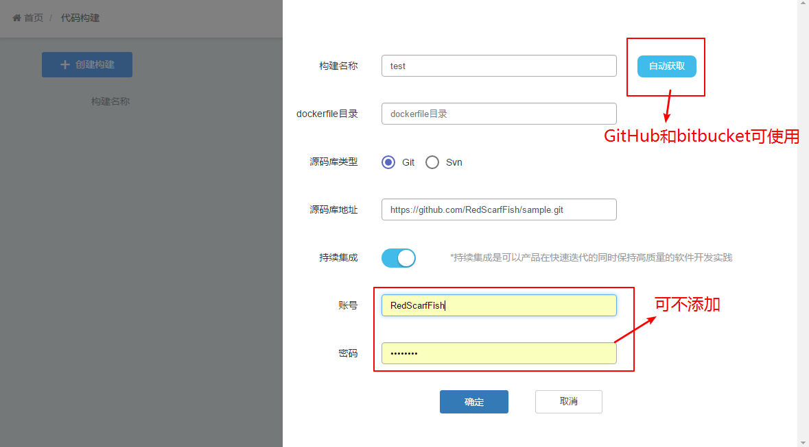
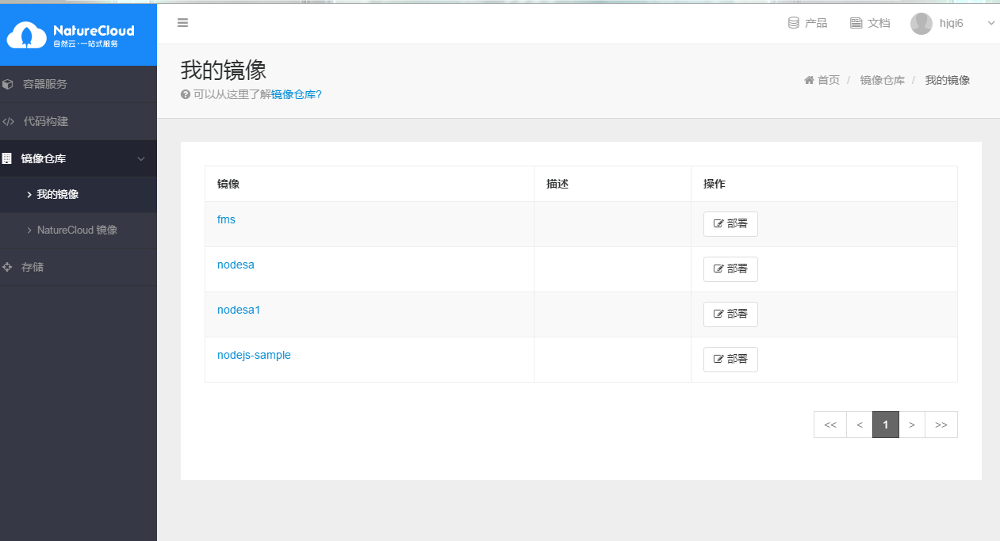
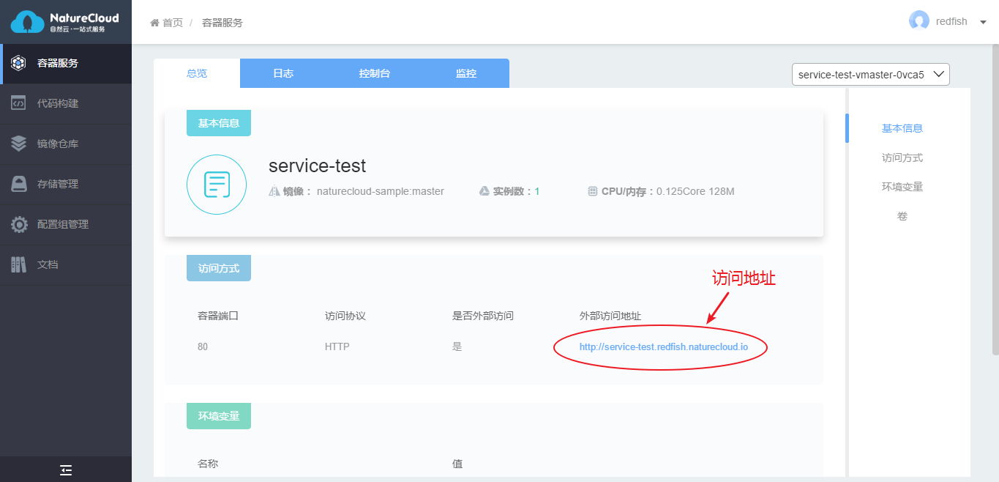
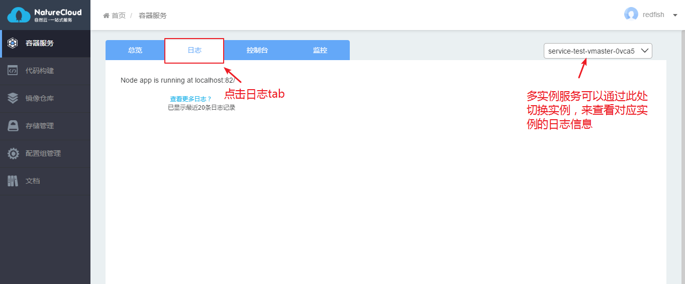
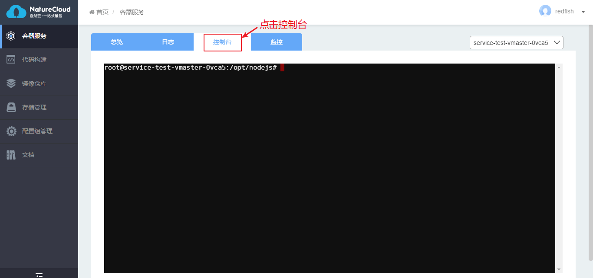
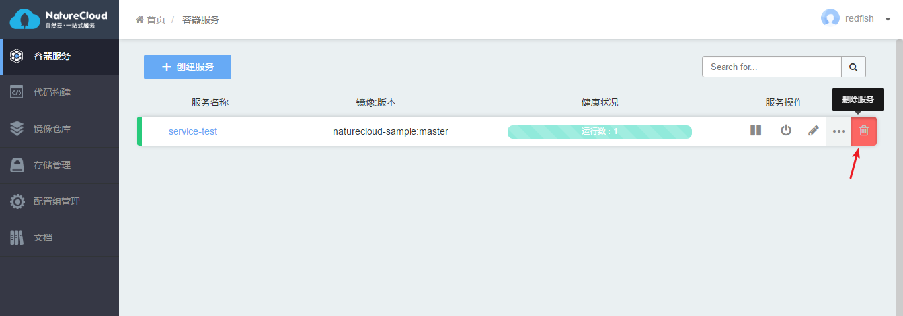

下面通过hello world的例子，介绍如何使用平台进行应用的快速交付。

### 第一步：准备Dockerfile ###

前期需要准备镜像，可以选择以下两种的任一种

- #### 直接写Dockerfile ####

	这个例子只有一个源码文件helloworld.html，helloworld.html放在跟Dockerfile同一个目录中。

		root@node:/data01/sample# ls
		Dockerfile  helloworld.html

	Dockerfile内容如下
	
		FROM naturecloud.io/nginx:1.9.14         #以自然云官方的nginx镜像（选择版本1.9.14）为基础镜像

		ADD helloword.html /usr/share/nginx/html #将helloword.html添加到镜像中的目录/usr/share/nginx/html

- #### 通过容器完成Dockerfile过程 ####

	docker run 系统镜像，然后进入容器里安装依赖
	
		root@node:~# docker run  -it naturecloud.io/ubuntu:trusty /bin/bash
		root@e72d0f78365f:~#apt-get install xxxx
		root@e72d0f78365f:exit
		root@node:~# docker ps -a | grep naturecloud.io/ubuntu:trusty
		e72d0f78365f        naturecloud.io/ubuntu:trusty                                      "/bin/bash"          51 minutes ago      Exited (130) 55 seconds ago     
		root@node:~# docker commit e72d0f78365f mynginx-image
		c868d49c60726e42172465234a84232a4ec3f87a14f24aeb9be4c790a9cfaae7

	跟环境相关的依赖什么安装后，然后只需要将自己的最终的dockerfile from 之前的基础镜像，加入自己的执行程序和启动脚本即可。

### 第二步：生成镜像 ###

镜像是应用最终的交付件，选择以下两种的任一种生成镜像

- #### 平台构建 ####
	
	平台创建可以对接github,bitbucket源码托管的平台
	
	在选择某个工程后，进入构建环节，构建完成后可以在我的镜像中查看到之前构建的镜像
	
	

- #### 线下构建 ####

	线下构建的前期准备可以参考dockerfile制作过程。
	
	在镜像构建完成后，通过打tag，将镜像推送到平台的registry

		docker tag $IAMGE_ID   naturecloud.io/$namespace/$IAMGE_NAME
		docker push naturecloud.io/$namespace/$IAMGE_NAME
		
	这时就可以在平台中，我的镜像里看到，之前push过来的镜像

### 创建服务 ###

先选择之前上传的镜像，然后点击部署	

然后再服务创建信息页面填写相关参数

最后点击创建，服务列表里可以看到之前创建的服务

### 管理服务 ###

#### 服务详情 ####

点击服务名，进入服务详情页面

**访问服务**

然后使用url，访问之前添加到helloworld.html

**查看日志**

**登录服务**

#### 版本更新 ####

在服务列表里面点击版本变更

#### 启动/停止服务 ####

#### 伸缩 ####

通过伸缩扩容来实现服务的快速横向扩容

#### 修改服务 ####

在服务列表里点击修改服务按钮，然后会进入和服务创建的相同的页面，进行服务信息的修改

#### 删除服务 ####

点击服务列表里的删除按钮

### 温馨提示 ###

通过5分钟入门，期望大家可以对自然云的使用有个基本的了解。要了解详细的内容，请参阅

1. 后续章节中对每一功能的详细介绍
2. [常见问题](../q&a)
