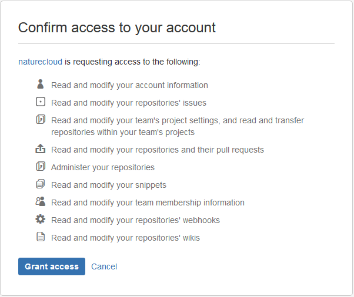

代码构建获取源码、编译、打包，最终生成docker镜像。

代码构建之前需要做好如下准备工作：
1. 代码已经托管在“代码托管平台”（目前平台支持所有主流的代码托管平台，其中GitHub和bitbucket支持自动获取代码）
2. 源代码中包含项目对应的[Dockerfile](../dockerfile)。

## 创建构建 ##
1. 打开“代码构建“子页面
2. 点击“创建构建”，可以根据平台来选择手动添加还是自动获取的方式来创建构建
3. 手动添加则直接添加信息确定创建构建
4. 自动获取则点击按钮进入自动获取代码界面，选择代码源（github、bitbucket等），点击“获取代码列表”
5. 假定选定的bitbucket，此时可能会跳出bitbucket的登录页面，登陆之后会跳出如下页面。点击Grant access

6. 此时已经跳转回naturecloud的构建页面，同时会出现bitbucket中的项目列表，选中其中一个项目，跳出一个对话框，输入构建信息即可。

## 构建历史及详情 ##
	
在“代码构建”页面，点击某个构建，即可查看构建历史。在构建历史页面中，选择其中一次构建，即可查看该次构建的结果输出。
