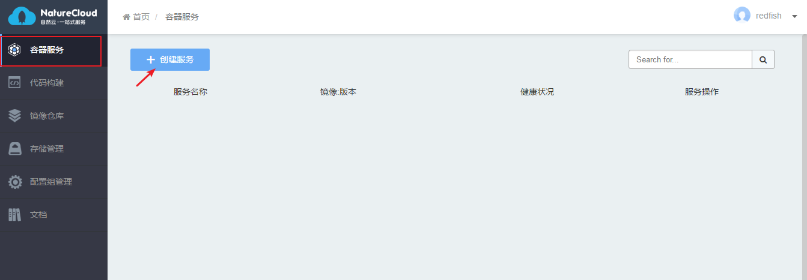
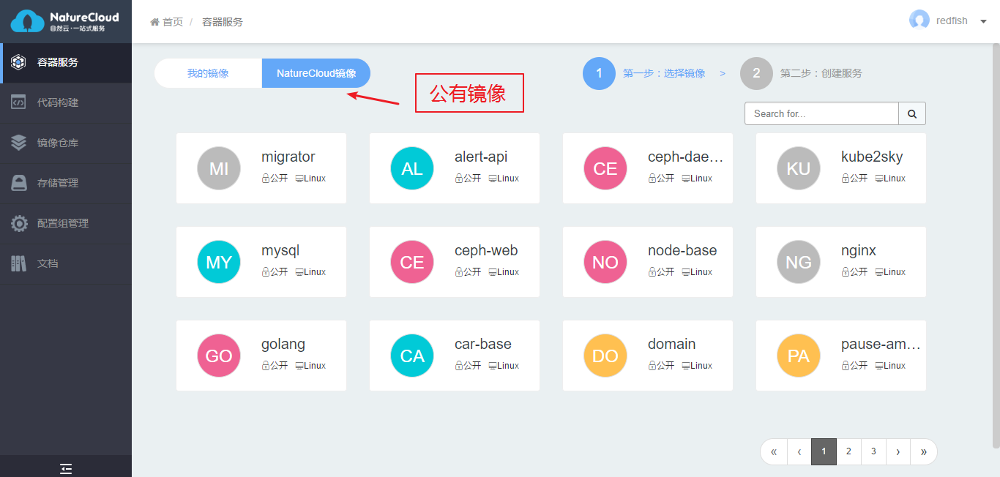
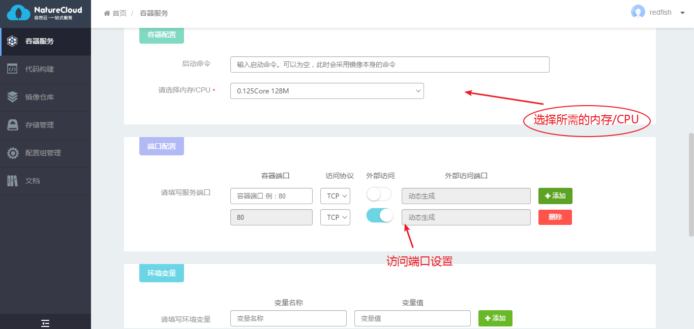

用户在登录后，进入控制台，点击左侧 容器服务
 

右侧会显示 创建过的服务列表，点击 创建服务按钮 进入服务创建页面，在服务创建页面中可以选择自己的镜像，也可以选择公有镜像。 （关于镜像的来源和具体介绍，请参考[镜像](/img)章节）

直接点击镜像即可部署应用

然后需要填写应用信息和相关参数

> 服务名 是用户帐户下应用的唯一标识
> 
> 镜像   是在之前选择的基础上选择需要部署版本
> 
> 容量  是向平台请求服务运行资源 0.25C 代表cpu资源是250M ,128Mi代表内存资源是128m
> 
<!--> 集群容量 是指启动的实例数量，可以做高可用，负载均衡。-->
>
> 启动命令 服务的启动命令。可以为空，这样就采用镜像中指定的启动命令。
> 
> 服务端口 指定了服务需要提供的访问方式，访问服务端口的可以是平台内部的其他服务，也可以是平台外部。容器端口表示容器内部的端口号，是必填项。访问协议指的是以什么形式访问该端口，是必填项。只有该端口需要外部访问时，外部访问端口；当访问协议为HTTP时,平台会为该服务提供一个访问url；当访问协议为TCP时，平台会提供一个外网IP和外网端口。
> 
> 环境变量 服务运行时使用的环境变量
> 
> 卷 当需要把一些数据（如日志及服务产生的其他数据）持久保存时，或者读取外部数据（如配置文件）时，通过卷的形式挂载进来即可。挂载卷可以是用户自己在存储部分创建好的卷；也可以为空，这样平台会自动分配卷。

在填写完相关信息后，点击添加，就可以在刚才的服务列表，看到刚才添加到服务应用，并且包括当前服务的状态。

