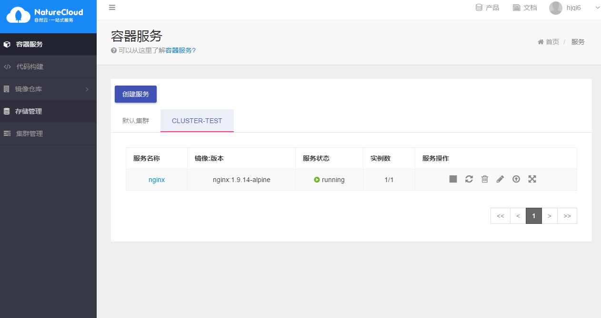

1. # 集群创建 #

	点击左侧 集群管理，然后点击创建集群
	
	
	
	在对话框里输入创建集群的名称cluster-test ，点击确定后，该集群就被创建了。
	
	
	
	然后在列表里可以看到刚才添加的集群，状态为未就绪，显示节点数为0
	
	
	
	点击管理按钮，进入管理明细页，管理节点。

2. # 节点添加 #

	点击添加节点，将自己的主机添加入刚才创建的集群

	
	
	第一步需要确认自己的主机上已经安装docker,如果未安装，可以执行脚本安装，然后再安装完毕后确认服务正常启动

	

	第二步安装nc-agent，将命令在将要加入集群的主机上执行

	

	将命令在自己的主机上执行
	
	

	点击页面上添加按钮等待主机上脚本安装完毕

	
	
	在命令安装完毕后，页面会自己跳转到集群详情页

	
	
	查看节点状态,connected 表示nc-agent已经连到平台，但是整个集群的状态还需等待集群服务在主机上启动完毕。（因为需要下镜像，所以集群到ready状态需要等待几分钟，可以通过点击刷新按钮来查看最新的状态，只有在第一次安装会比较慢）
	
	

	在数分钟后，集群服务已经正常起来，可以看到状态已经更新了。
	
	

	这个时候就可以正常使用集群了。

3. # 服务创建 #
	
	在容器服务列表里可以看到之前创建过的集群
	
	

	创建一个nginx的服务，选择之前创建过的cluster-test集群,其他创建参数和普通创建服务一致，具体可以参考服务创建章节。

	

	在之前cluster-test tab页里可以看到刚才创建的nginx服务
	
	
	
	等待服务启动完毕后，就可以和默认集群创建的服务那样，执行任何操作
	
	

	